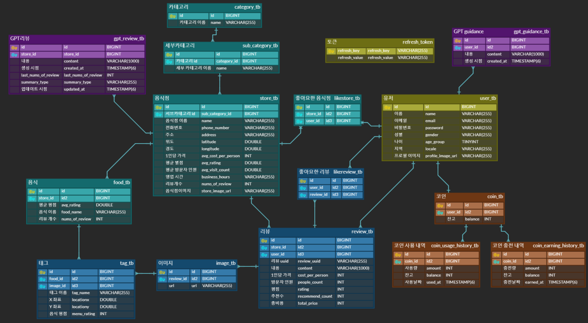
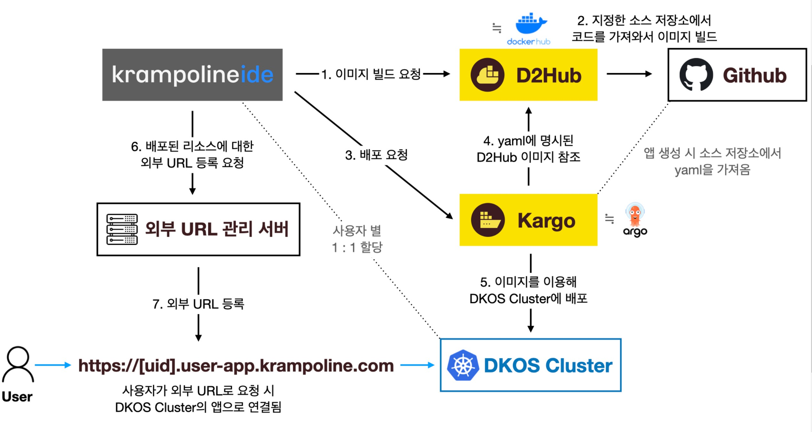

# Team4_BE

## [MatGPT] 외국인을 위한 음식점 정보 제공 및 주문 도움 서비스

### 프로젝트 소개

우리의 혁신적인 음식 리뷰 플랫폼은 다국적 사용자들에게 다양한 언어로 맛과 멋을 소개하며, ChatGPT를 활용한 개인 맞춤 주문 도움말과 음식에 달린 태그를 통해 사용자들은 손쉽게 원하는 음식을 발견하고 주문할 수 있습니다. 눈으로 먼저 맛보는 차원의 음식 탐험을 지금 시작하세요!

### 개발 동기

해외여행을 가서 음식점에 대한 정보를 얻기 힘들며, 원하는 음식을 제대로 주문하기 쉽지 않았다. 리뷰를 봐도 이 음식이 그 음식인지 모르는 경우도 빈번했다.

### 기대 효과

외국인이 음식점의 좋은 리뷰 요약과 안 좋은 리뷰 요약을 통해 음식점의 전반적인 평가를 알 수 있으며, 여러 나라의 언어로 번역하여 제공되는 서비스이기 때문에 어느 나라에서도 서비스를 사용할 수 있다. 또한, 음식 리뷰에 달린 태그를 통해 해당 음식이 어떤 음식인지 확실히 알 수 있다. 작성된 리뷰를 보고 해당 음식을 주문하고 싶은 외국인은, 그 음식을 바로 요구할 수 있으며 해당 나라의 음식 문화에 맞게 ChatGPT가 주문을 도와줌으로써 주문을 더 수월하게 가능하도록 한다.

## 개발 기간

2023.09 ~ 2023.11

## 팀원

공희찬  
이승현  
조민기  
조영진

## 기술 스택

### 개발 환경

- JDK17
- Gradle
- Springboot 3.1.3
- Spring Data JPA

### 보안

- SpringSecurity6
- JWT

### 테스트

- Junit5
- Mockito

### 데이터베이스

- H2 (개발 환경)
- MySQL+Docker (배포 환경)
- AWS S3 (이미지 저장)

### 문서화

- Swagger-UI

### 외부 API

- ChatGPT(gpt-3.5-turbo)

### 배포

- 카카오 크램폴린(Kargo)

## 주요 기능 및 구현 방법

### Login/UserPrincipal

- 인증 / 인가
    - 스프링 시큐리티 + jwt
    - 인증 / 인가된 사용자만이 접근할 수 있는 api를 구분하기 위해 `@PreAuthorized` 사용
- 보안
    - 사용자 정보를 다루는 User 에 UserDetails 인터페이스를 구현하지 않고 따로 UserPrincipal을 만들어 불필요한 사용자 정보를 인증 과정에서 노출하지 않음으로써 보안 강화
    - 역할 분리를 하여 유지 보수와 확장에 용이하게 설계
    - 이후에 구현된 **`UserPrincipal`** 객체를 Spring Security 컨텍스트 내에서 사용자의 정보로 캐스팅하여 사용

### User

- 추천 시스템을 위한 정보 수집
    - 연령대, Locale(문화권), 성별 등을 고려하여 Store내의 Food를 추천 순으로 조회 가능
    - int 타입으로의 나이를 특정 집단(Enum 타입)으로 저장하여 추천 음식, 음식점을 제공해줄때 성능을 향상 시켰
    - Enum 타입으로의 저장

### ChatGPT

- ChatGPT API를 이용하여 음식점의 평점이 높은 리뷰들과 낮은 리뷰들을 각각 요약하여 음식점 정보에 제공
    - RestTemplate를 활용한 ChatGPT API 요청, `@Async` 를 이용하여 비동기 및 멀티스레드 동작
    - `@Scheduled` 를 이용한 Cron 동작 (매주 일요일 새벽마다 모든 음식점의 리뷰 요약 업데이트)
    - API 호출 시간을 파악하기 위하여 AOP를 이용해 `@Timer` 구현
    - API 응답의 예외처리를 위한 ApiException 구현
- 사용자의 국적(Locale)을 기반으로 해당 문화권의 음식 문화를 파악하여 ChatGPT가 주문 도움 프롬프트를 생성함으로써 사용자의 주문을 도와줌
    - 로그인된 사용자의 Locale 정보를 활용하여 문화권 파악 후, ChatGPT API 호출
    - (서비스 이용자가 특정 종교인이라면, ‘음식에 해당 종교에서 민감한 재료가 들어갔다면 말씀해주세요’ 와 같이 안내 가능)

### Store

- 특정 조건으로 정렬된 음식점 목록, 음식점의 리뷰 목록, 작성한 리뷰 목록, 좋아요한 음식점 목록, 좋아요한 리뷰 목록
    - 커서 기반 페이지네이션을 통한 구현
- 음식점 검색 기능
- 다른 나라의 음식에 익숙하지 않은 외국인을 위하여, 리뷰 사진에 ‘태그’ 기능을 추가하여, 해당 음식이 어떤 음식인지 파악할 수 있도록 도움.
- 태깅된 음식에 대한 정보를 저장함으로써, 추천 시스템에 활용할 수 있음

### Review

- 작성한 리뷰 목록
    - (추천순/최신순) 정렬, 커서 기반 페이지네이션
- 좋아요한 리뷰 목록(좋아요 최신순) 조회
    - (좋아요한 최신순) 정렬, 커서 기반 페이지네이션 구현
- 개별 리뷰 상세 페이지 조회
    - 리뷰 상세 내용 / 사용자가 리뷰에 등록한 음식 사진 / 리뷰 내용에 언급된 메뉴들이 사진 속 어떤 음식을 가리키는지 태그를 달아 표시
- 리뷰 작성 기능
    - 최초 요청: 요청 받은 리뷰 정보를 저장한 후 이미지를 업로드할 presigined url을 응답
    - 추가 요청: 리뷰에 이미지를 등록할 경우 추가 요청
        - 업로드 완료한 이미지 url을 포함한 이미지, 태그 정보를 저장
        - 태그는 각 이미지에 마킹할 x,y 위치 정보와 메뉴 별점 포함
    - Store와 Food의 리뷰 관련 정보도 업데이트됨.
- 수정은 리뷰 텍스트 내용만 수정 가능함
- 삭제 기능
    - 리뷰 삭제 요청을 받으면 리뷰, 이미지, 태그, s3에 업로드된 이미지까지 모두 삭제
    - Store와 Food의 리뷰 관련 정보도 업데이트됨.
- 리뷰 좋아요 기능
    - 리뷰에 좋아요를 등록/해제할 수 있음
    - 특정 리뷰에 본인이 좋아요를 누른 상태인지 표시됨

### Coin

- 코인 사용 목록, 코인 충전 목록 조회
    - 커서 기반 페이지네이션을 통한 구현
- 기본적으로 일정량의 코인 제공
- 사진 리뷰를 작성함으로써 코인을 얻을 수 있으며, 주문 프롬프트를 이용 시 코인이 필요함

### S3

- 리뷰 이미지 업로드는 presigned Url 방식을 사용
    - 요청받은 이미지 개수만큼의 presigned Url을 응답하면 프론트에서 직접 이미지 업로드
    - 백엔드에서는 프론트에서 업로드 완료된 이미지의 주소만 저장
- 리뷰 삭제 요청 시 s3로 삭제 요청

### Common

- 예외 처리
    - 표준예외를 가급적 사용하며, 필요한 예외를 만들어서 사용. ErrorMessage를 한곳에서 관리
- Auditing
    - 리뷰 작성 시점, 수정 시점, 작성자, 수정자를 관리하기 위하여 `BaseEntity`, `BaseTimeEntity` 구현
- 응답 통일
    - `ApiUtils` 클래스를 통한 응답 통일
    - `PageResponse`, `Paging` 클래스를 통한 페이지네이션의 응답 통일


## ERD


## 테스트 결과 보고서
[노션 링크](https://www.notion.so/_4-070e9f6ce3744104a0b8384f98c60151?pvs=4)

## 테스트 시나리오 명세서

[노션 링크](https://www.notion.so/_4-f95067f4d5ed449a8b2d9ddd39afff22?pvs=4)

## 배포 프로세스


## How to Use

```docker
$ git clone https://github.com/Step3-kakao-tech-campus/Team4_BE.git
$ cd Team4_BE
$ ./gradlew build
$ cd build/libs
$ java -jar matgpt-0.0.1-SNAPSHOT.jar
```


<details>
<summary>카카오 테크 캠퍼스 3단계 진행 보드</summary>
<div markdown="1">

## 카카오 테크 캠퍼스 3단계 진행 보드

</br>

## 배포와 관련하여

```

최종 배포는 크램폴린으로 배포해야 합니다.

하지만 배포 환경의 불편함이 있는 경우를 고려하여 

임의의 배포를 위해 타 배포 환경을 자유롭게 이용해도 됩니다. (단, 금액적인 지원은 어렵습니다.)

아래는 추가적인 설정을 통해 (체험판, 혹은 프리 티어 등)무료로 클라우드 배포가 가능한 서비스입니다.

ex ) AWS(아마존), GCP(구글), Azure(마이크로소프트), Cloudtype 

```
## Notice

```
필요 산출물들은 수료 기준에 영향을 주는 것은 아니지만, 
주차 별 산출물을 기반으로 평가가 이루어 집니다.

주차 별 평가 점수는 추 후 최종 평가에 최종 합산 점수로 포함됩니다.
```


[git flowchart_FE.pdf](https://github.com/Step3-kakao-tech-campus/practice/files/12521045/git.flowchart_FE.pdf)


</br>

## 필요 산출물
<details>
<summary>Step3. Week-1</summary>
<div>
    
✅**1주차**
    
```
    - 5 Whys
    - 마켓 리서치
    - 페르소나 & 저니맵
    - 와이어 프레임
    - 칸반보드
```
    
</div>
</details>

---

<details>
<summary>Step3. Week-2</summary>
<div>
    
✅**2주차**
    
```
    - ERD 설계서
    
    - API 명세서
```
    
</div>
</details>

---

<details>
<summary>Step3. Week-3</summary>
<div>
    
✅**3주차**
    
```
    - 최종 기획안
```
    
</div>
</details>

---

<details>
<summary>Step3. Week-4</summary>
<div>
    
✅**4주차**
    
```
    - 4주차 github
    
    - 4주차 노션
```
    
</div>
</details>

---
<details>
<summary>Step3. Week-5</summary>
<div>
    
✅**5주차**
    
```
    - 5주차 github
    
    - 5주차 노션
```
    
</div>
</details>

---

<details>
<summary>Step3. Week-6</summary>
<div>
    
✅**6주차**
    
```
    - 6주차 github
    
    - 중간발표자료
    
    - 피어리뷰시트
```
    
</div>
</details>

---

<details>
<summary>Step3. Week-7</summary>
<div>
    
✅**7주차**
    
```
    - 7주차 github
    
    - 7주차 노션
```
    
</div>
</details>

---

<details>
<summary>Step3. Week-8</summary>
<div>
    
✅**8주차**
    
```
    - 중간고사
    
```
    
</div>
</details>

---

<details>
<summary>Step3. Week-9</summary>
<div>
    
✅**9주차**
    
```
    - 9주차 github
    
    - 9주차 노션
```
    
</div>
</details>

---

<details>
<summary>Step3. Week-10</summary>
<div>
    
✅**10주차**
    
```
    - 10주차 github
    
    - 테스트 시나리오 명세서
    
    - 테스트 결과 보고서
```
    
</div>
</details>

---

<details>
<summary>Step3. Week-11</summary>
<div>
    
✅**11주차**
    
```
    - 최종 기획안
    
    - 배포 인스턴스 링크
```
    
</div>
</details>

---

## **과제 상세 : 수강생들이 과제를 진행할 때, 유념해야할 것**

```
1. README.md 파일은 동료 개발자에게 프로젝트에 쉽게 랜딩하도록 돕는 중요한 소통 수단입니다.
해당 프로젝트에 대해 아무런 지식이 없는 동료들에게 설명하는 것처럼 쉽고, 간결하게 작성해주세요.

2. 좋은 개발자는 디자이너, 기획자, 마케터 등 여러 포지션에 있는 분들과 소통을 잘합니다.
UI 컴포넌트의 명칭과 이를 구현하는 능력은 필수적인 커뮤니케이션 스킬이자 필요사항이니 어떤 상황에서 해당 컴포넌트를 사용하면 좋을지 고민하며 코드를 작성해보세요.

```

</br>

## **코드리뷰 관련: review branch로 PR시, 아래 내용을 포함하여 코멘트 남겨주세요.**

**1. PR 제목과 내용을 아래와 같이 작성 해주세요.**

> PR 제목 : 부산대_0조_아이템명_0주차
> 

</br>

</div>
</details>
